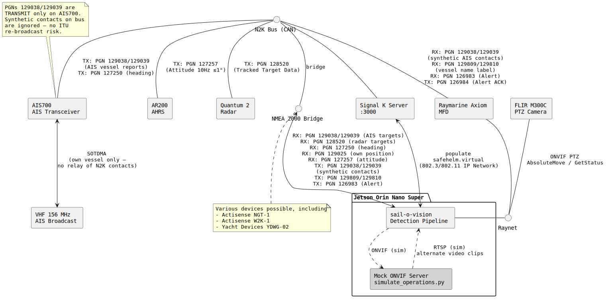

# Sail-O-Vision

Real-time marine obstacle and wildlife detection system running on an NVIDIA Jetson Orin Nano Super. 
Designed for liveaboard sailing use — detects vessels, debris, and anything that isn't water in the 
forward arc, with a web-based live view and alert system.

## Hardware

- NVIDIA Jetson Orin Nano Super Dev Kit ($150 + NVMe SSD) — ~9W active power draw
- FLIR M300C visible-light PTZ camera (onboard deployment — driveway camera used for development)
- Raymarine Axiom MFD + AR200 (handles AIS/radar — this system is supplementary)
- Transparent N2K-IP bridge (e.g. Actisense NGT-1/W2K-1 or Yacht Devices YDWG-02) — sail-o-vision reads and writes N2K PGNs directly

## What it does

- Two-stage AI detection pipeline: eWaSR segmentation (Stage 1) + YOLO classification on zoomed crops (Stage 2)
- Runs at ~14-17 FPS end-to-end with TensorRT optimization (Jetson Orin Nano Super)
- Web interface at `http://jetson.local:5000` showing live annotated video
- Browser alert (visual + audio) when something is detected above confidence threshold
- Persistent detection log with paginated gallery, click-to-view annotated images
- Starts automatically on boot via systemd
- Auto-reconnects on stream dropout

## System Architecture



## Two-Stage Pipeline Architecture

### Stage 1 — eWaSR Wide FOV Scan

[eWaSR](https://github.com/tersekmatija/eWaSR) (embedded Water Segmentation and Recognition, Teršek et al., Sensors 2023) runs continuously on the camera feed, segmenting each frame into obstacle / water / sky. Connected-component analysis finds obstacle blobs in the water region. Coastline blobs are filtered by shape (aspect ratio > 4, area > 5% of image, touching image edges). Surviving blobs trigger Stage 2.

- Input: 192×256 (downsampled from 4K)
- Inference: ~53ms on Orin GPU
- Fine-tuned on KOLOMVERSE for fishnet buoy detection
- Trained on: MaSTr1325 (baseline) + KOLOMVERSE validation set (fine-tune)

### Stage 2 — YOLO Zoom and Verify

When Stage 1 finds a candidate, a 4× zoom crop is extracted from the full-resolution frame centered on the blob centroid (simulating PTZ zoom). YOLOv8s classifies the crop. Confirmed detections above confidence threshold generate alerts.

- Model: yolov8s fine-tuned on KOLOMVERSE (mAP50: 0.830)
- Classes: ship (0), buoy (1), fishnet buoy (2), lighthouse (3), wind farm (4)
- Alert classes: ship, buoy, fishnet buoy
- Inference: ~45ms on Orin GPU

### eWaSR Fine-tuning Pipeline

eWaSR was fine-tuned to improve detection of fishnet buoys and small vessels:

1. KOLOMVERSE bounding box annotations → MobileSAM pixel masks (pseudo-ground-truth)
2. eWaSR baseline predictions supply sky/water labels for unannotated pixels
3. Combined masks used for supervised fine-tuning
4. Training on Google Colab T4 (Jetson cannot train 60M parameter model in-memory)
5. Result: visible improvement on fishnet buoy detection (image 0000068636)

Scripts: `~/sail-o-vision/samples/generate_masks.py`, masks at `~/sail-o-vision/samples/masks_kolomverse/`
Fine-tuned weights: `~/sail-o-vision/samples/eWaSR/pretrained/ewasr_kolomverse.pth`

## What it's for

The Raymarine stack (AIS + radar + AR200) handles vessel collision avoidance. This system covers 
what radar doesn't resolve well at close range:

- Debris, logs, shipping containers low in the water
- Whales and large marine wildlife at the surface
- Small non-AIS vessels (kayaks, dinghies) at close range
- Anything that breaks the water surface texture


### Whale Detection: Capabilities and Limitations

Sail-o-vision includes whale detection as a secondary mission alongside its primary navigation safety function. This section documents the technical basis for whale detection, its inherent limitations, and realistic expectations for operational performance.

#### Detection Approach

Whale detection uses the same two-stage pipeline as vessel detection. Stage 1 (eWaSR) segments the scene into obstacle/water/sky regions and flags candidate blobs. Stage 2 uses YOLOE-26's open-vocabulary capability to classify candidates, with text prompts targeting whale-specific visual features: spout plume, dorsal fin, fluke, and surfacing back.

#### Why Whale Detection is Hard

**The spout is the best thermal target, but sail-o-vision is a visible-light system.** Commercial whale detection systems such as WhaleSpotter (whalespotter.com) are built around thermal/infrared cameras. The physical basis for thermal detection is that a whale's exhalation is a jet of warm compressed air, producing a distinctive thermal signature detectable at ranges up to several kilometers even when the spout subtends less than one pixel. In visible light, the same spout appears as a white/gray mist easily confused with whitecaps, spray, and seabirds. This is not a solvable problem through better algorithms — it is a fundamental physics difference between the two sensing modalities.

**Even purpose-built thermal systems have limited recall.** Smith et al. (2020) conducted a field study using a high-sensitivity cooled LWIR infrared system (FIRSTnavy, Rheinmetall) with custom detection software (Tashtego) during seismic survey operations offshore Atlantic Canada. Despite continuous 244.5° coverage and a research-grade cooled sensor, only 21.3% of cetacean detections made by trained human observers were associated with a real-time IR alert. The IR system missed approximately 79% of detections that experienced marine mammal observers made visually or acoustically. Sail-o-vision, operating in visible light with a narrower scanning arc, should be expected to achieve lower recall than this thermal baseline (Smith et al., *Marine Pollution Bulletin*, Vol. 154, 2020, DOI: 10.1016/j.marpolbul.2020.111026).

**False positives from seabirds are the dominant noise source and can render alerting operationally unusable.** The same study found that in temperate coastal waters with significant seabird activity, false positive rates were high enough that trained MMOs turned the alerting system off entirely rather than deal with the distraction. A gannet breaking the water's surface produces a splash that mimics the appearance of a whale blow in IR imagery; in visible light this confusion is greater still. The study identified a manageable baseline of approximately six false positives per hour in low-bird-density conditions (Arctic/Southern Ocean), but rates exceeding one per minute in the presence of bird flocks. Temporal filtering — requiring candidate detections to persist across multiple frames and recur on a plausible breathing cycle interval (~60–90 seconds) — reduces but does not eliminate seabird false positives. Alert thresholds must be set conservatively to avoid alert fatigue.

**Sail-o-vision is a "bell-ringer," not a stand-alone detection system.** Smith et al. explicitly characterize IR-based marine mammal detection systems as useful "bell-ringers" for human watchkeepers rather than autonomous detection and classification systems. This framing applies with even greater force to a visible-light system. Sail-o-vision whale alerts indicate that something in the scene warrants crew attention — they are not confirmations of whale presence and should not be treated as such.

**Range is limited.** In good visibility and favorable lighting, a whale's surfacing back or dorsal fin may be detectable at 500–1000m with the 30× optical zoom engaged. The spout plume may extend this range somewhat under ideal conditions. At 8 knots, 500m detection range gives approximately 2 minutes of warning.

**There is a geometric close-in blind spot.** At a mast-mounted camera height of approximately 22m, the geometry of the camera's vertical field of view creates a minimum detectable range at sea level of approximately 60–90m depending on camera depression angle. Smith et al. document a similar constraint, noting a minimum detection distance of ~90m at 28.5m camera height. Targets inside this range are not detectable regardless of algorithm performance.

**Night performance is limited.** Whale detection degrades significantly in low-light conditions. In true low-light conditions (new moon, overcast, offshore), whale detection should not be relied upon.

#### Realistic Operational Expectations

Sail-o-vision's whale detection is best understood as opportunistic observation support rather than a collision-avoidance system. It will:

- Provide a "bell-ringer" alert that warrants crew attention and visual confirmation
- Detect large whales reliably at close range (under ~300m) during daylight in good visibility
- Provide useful detection at 300–700m under favorable conditions with the zoom pipeline engaged
- Perform better for surface-active whales than for animals that surface briefly

It will not:

- Achieve the ~21% recall rate of purpose-built cooled LWIR systems, let alone exceed it
- Provide reliable detection beyond ~1km in any conditions
- Operate reliably at night or in fog
- Detect submerged whales
- Replace watchkeeping or radar as the primary collision avoidance tool

#### Operational Context

Whale strike on recreational vessels is a low base-rate event. Radar remains the primary collision avoidance tool. Sail-o-vision's whale detection capability is a meaningful enhancement to situational awareness in coastal areas with known whale activity, and supports the secondary mission of wildlife observation and documentation.

#### Non-Academic Articles about Whale Detection

https://spectrum.ieee.org/whales-ai-thermal-camera-tracking
https://spectrum.ieee.org/snotbot-drone-swoops-over-blowholes-to-track-whale-health 


## Performance

### Detection pipeline

| Version | Mean latency | FPS | Notes |
|---------|-------------|-----|-------|
| PyTorch, video file | 121ms | 8.3 | Includes disk I/O |
| TensorRT, video file | 70ms | 14.2 | Includes disk I/O |
| TensorRT, live feed (estimated) | ~60ms | ~17 | No disk I/O |

Latency varies with scene complexity — frames with no obstacle blobs run in 15-23ms (eWaSR only); frames with 2-3 blobs run 120-180ms (eWaSR + multiple YOLO crops).

### TensorRT speedups

| Model | PyTorch | TensorRT | Speedup |
|-------|---------|----------|---------|
| eWaSR ResNet-18 (192×256) | 53ms | 17ms | 3× |
| YOLOv8s (640px crop) | 45ms | 39ms | 1.2× |

Engine files (hardware-specific to Orin Nano Super, not transferable):
- eWaSR: `~/sail-o-vision/samples/ewasr_resnet18.engine`
- YOLO: `~/sail-o-vision/samples/KOLOMVERSE/scripts/models/yolov8s_kolomverse/weights/best.engine`

### Detection quality

Evaluated on KOLOMVERSE validation set (1,746 annotated images, 5 classes):

| Model | mAP50 | ship | buoy | fishnet buoy | lighthouse | wind farm |
|-------|-------|------|------|--------------|------------|-----------|
| yolov8s_kolomverse | 0.830 | 0.928 | 0.763 | 0.724 | 0.855 | 0.878 |

Cross-dataset generalization is poor (KOLOMVERSE → SMD: 0.371 mAP) — domain gap between Korean coastal waters and other maritime environments. Mixed-dataset training is the planned fix.

### Evaluation framework

Standard mAP is not the right metric for navigation safety. The correct framework is the **MODS evaluation protocol** (Bovcon et al., IEEE T-ITS 2021):
- Class-agnostic recall within a **danger zone** (not mAP50)
- 15% overlap threshold (vs 50% IoU for standard mAP)
- Asymmetric cost: missed detection >> false positive
- Code: [github.com/bborja/mods_evaluation](https://github.com/bborja/mods_evaluation)

## Target Priority Architecture

Sail-o-vision fuses camera detections with AIS and radar data from the N2K bus to prioritize PTZ attention:

**Priority 1a** — Camera detection (high confidence), no AIS, no radar contact  
Unknown object: debris, whale, shipping container, unlit vessel. Highest threat uncertainty. 
Immediate PTZ zoom-and-verify.

**Priority 1b** — Camera detection (low confidence), no AIS, no radar contact  
Uncertain detection with no corroborating contact. Queued for next available PTZ slot.

**Priority 2** — Radar contact, no AIS  
Something with a radar return but not broadcasting — fishing vessel, small craft, or 
deliberately AIS-dark vessel. PTZ zoom provides visual identification.

**Priority 3** — Radar + AIS contact  
Fully identified contact already tracked by Raymarine. PTZ zoom is opportunistic — confirm 
vessel type, get a visual on close-passing traffic.

AIS targets arrive as PGN 129038/129039, radar auto-acquired targets as PGN 128520 (Tracked
Target Data), heading as PGN 127250, and own vessel position as PGN 129025 — all read
directly from the N2K bus via a transparent N2K-IP bridge. No NMEA 0183 conversion layer.
Own vessel heading allows conversion of all contacts to absolute bearings for camera slew targeting.

## PTZ Scan Pattern

The M300C has a 63.7° horizontal field of view at wide angle, narrowing to 2.3° at 30x zoom.

Offshore scan cycle (tunable):
- **Ahead**: 5 minutes (default, primary safety function)
- **Port flank**: 30 seconds
- **Starboard flank**: 30 seconds

Flank scans create a blind spot ahead and are kept short. Any detection during a flank scan 
immediately triggers zoom-and-verify for that contact, then returns to ahead scanning. 
After any state, the camera always returns to SCANNING_AHEAD — never directly to a flank scan.

State machine:
```
SCANNING_AHEAD → (timer) → SCANNING_FLANK
SCANNING_AHEAD → (detection) → VERIFYING_TARGET
SCANNING_FLANK → (timer or hard timeout) → SCANNING_AHEAD
SCANNING_FLANK → (detection) → VERIFYING_TARGET
VERIFYING_TARGET → (confirmed) → ALERT + VIDEO_TRACKING
VERIFYING_TARGET → (not confirmed or timeout) → SCANNING_AHEAD
VIDEO_TRACKING → (target lost or resolved) → SCANNING_AHEAD
```

## PTZ Authority and Raymarine Integration

The M300C supports slew-to-cue (radar/AIS integration) which allows the Raymarine Axiom to 
command the camera to point at tracked targets. Sail-o-vision and the Raymarine slew-to-cue 
system cannot both control the PTZ simultaneously — PTZ authority must be managed:

- **Default**: sail-o-vision runs the scan pattern
- **Raymarine slew-to-cue active**: sail-o-vision yields PTZ control
- **Slew-to-cue complete**: sail-o-vision resumes scan pattern

Note: Raymarine has not implemented video tracking on the M300C despite the camera supporting 
it via ONVIF. Sail-o-vision will implement this directly — once a target is confirmed via 
zoom-and-verify, a lightweight OpenCV tracker (CSRT or KCF, running on CPU alongside YOLO 
on GPU) keeps the camera locked on the target -- possibly while inference continues on the 
zoomed view.

## Installation

### Prerequisites

- Jetson Orin Nano Super with JetPack 6.2 (r36.5)
- Ubuntu 22.04
- CUDA 12.6, TensorRT 10.3 (included with JetPack)

### Power mode

The Orin Nano Super ships with the wrong nvpmodel config by default. Fix it first:

```bash
sudo cp /etc/nvpmodel/nvpmodel_p3767_0004_super.conf /etc/nvpmodel.conf
# Reboot when prompted
sudo nvpmodel -m 2   # MAXN_SUPER — full 67 TOPS
sudo jetson_clocks
```

### Python environment

```bash
python3 -m venv ~/venvs/vision --system-site-packages
source ~/venvs/vision/bin/activate
pip install --upgrade pip wheel

# Install NVIDIA PyTorch wheel for JetPack 6.2
# PyPI wheels do not work on Jetson — must use NVIDIA's specific builds
wget "https://nvidia.box.com/shared/static/zvultzsmd4iuheykxy17s4l2n91ylpl8.whl" \
     -O torch-2.3.0-cp310-cp310-linux_aarch64.whl
pip install torch-2.3.0-cp310-cp310-linux_aarch64.whl

wget "https://nvidia.box.com/shared/static/u0ziu01c0kyji4zz3gxam79181nebylf.whl" \
     -O torchvision-0.18.0-cp310-cp310-linux_aarch64.whl
pip install torchvision-0.18.0-cp310-cp310-linux_aarch64.whl

pip install "numpy<2"
pip install ultralytics flask opencv-python-headless
```

### TensorRT engine

Export the model once — this compiles for your specific hardware and takes ~10 minutes:

```bash
# Export eWaSR to ONNX then TensorRT
python3 ~/sail-o-vision/samples/export_ewasr_onnx.py
trtexec \
    --onnx=~/sail-o-vision/samples/ewasr_resnet18.onnx \
    --saveEngine=~/sail-o-vision/samples/ewasr_resnet18.engine \
    --fp16 \
    --memPoolSize=workspace:4096

# Export YOLO to TensorRT (takes ~8 minutes)
python3 -c "
from ultralytics import YOLO
model = YOLO('path/to/yolov8s_kolomverse/best.pt')
model.export(format='engine', half=True, device=0, imgsz=640)
"
```

The resulting engine files are hardware-specific and will not transfer to another device.

### Configuration

Edit the configuration section at the top of `vision_server.py`:

```python
RTSP_URL = "rtsp://your-camera-ip/stream"   # your camera's RTSP URL
CONF_THRESHOLD = 0.50                        # confidence for alerts
SAVE_THRESHOLD = 0.25                        # confidence for saving images
EXCLUDED_CLASSES = {"frisbee", "bench", "train"}  # false positive suppression
ALERT_COOLDOWN = 3.0                         # seconds between alerts
```

### Run as a service

```bash
sudo bash -c 'cat << EOF > /etc/systemd/system/vision.service
[Unit]
Description=Jetson Vision Server
After=network.target

[Service]
User=adam
WorkingDirectory=/home/adam
ExecStart=/home/adam/venvs/vision/bin/python3 -u /home/adam/sail-o-vision/vision_server.py
Restart=always
RestartSec=10

[Install]
WantedBy=multi-user.target
EOF'

sudo systemctl daemon-reload
sudo systemctl enable vision
sudo systemctl start vision
```

## Running

```bash
source ~/venvs/vision/bin/activate
```

### Two-stage pipeline (PyTorch)

```bash
# On a video file (dev/test)
python3 ~/sail-o-vision/samples/pipeline_live.py ~/sail-o-vision/samples/kolomverse_test.mp4

# On a live RTSP stream
python3 ~/sail-o-vision/samples/pipeline_live.py rtsp://camera-ip/stream
```

### Two-stage pipeline (TensorRT — faster)

```bash
# On a video file
python3 ~/sail-o-vision/samples/pipeline_trt.py ~/sail-o-vision/samples/kolomverse_test.mp4

# On a live RTSP stream
python3 ~/sail-o-vision/samples/pipeline_trt.py rtsp://camera-ip/stream
```

### Web server

```bash
python3 ~/sail-o-vision/vision_server.py
# Open http://jetson.local:5000
```

### NMEA / AIS client

```bash
python3 ~/sail-o-vision/nmea_client.py
```

### Evaluate on MVTD

```bash
python3 ~/sail-o-vision/evaluate_mvtd.py
```

## Usage

Open `http://jetson.local:5000` in any browser on your local network.

- **Live stream**: annotated video with bounding boxes
- **Alert bar**: fires with label and confidence when detection exceeds threshold
- **Audio alert**: plays in browser on detection
- **Gallery**: `http://jetson.local:5000/gallery` — paginated detection log with timestamps, 
  labels, and click-to-view images. Persistent across restarts.

## Planned (requires boat + M300C)

### Chartplotter and Alert Integration

**Synthetic AIS targets** — confirmed contacts injected directly onto the N2K bus as
synthetic Class B AIS entries (PGN 129039 for position, PGN 129809/129810 for vessel
name label). Axiom displays them as named chart targets. The AIS700 transponder ignores
these (PGNs 129038/129039 are Transmit-only on the AIS700 — no ITU re-broadcast risk).

**Alert PGN 126983** — sail-o-vision encodes and transmits PGN 126983 directly onto
the N2K bus. Triggers the Axiom's internal buzzer for Emergency Alarm class alerts.
Acknowledgement returns PGN 126984 from the Axiom.

Both paths go directly from sail-o-vision to the N2K bus via the same bridge interface
used for sensor inputs. Signal K is not in the Axiom integration path.

### N2K Integration

### PTZ Control
- ONVIF PTZ control of FLIR M300C
- Automated 180° horizon scan pattern (5 min ahead, 30s each flank, tunable)
- Zoom-and-verify on flagged bearings per target priority queue
- PTZ authority management between sail-o-vision and Raymarine slew-to-cue
- Video tracking via OpenCV CSRT/KCF tracker to maintain camera lock on confirmed targets
  while YOLO continues inference on the zoomed view

### Collision Alarms
For Priority 1 targets (camera-only, no AIS, no radar) on a collision course:

- **Primary**: PGN 126983 (Alert) transmitted directly by sail-o-vision onto the N2K bus — triggers Axiom buzzer. Axiom support confirmed (LightHouse 4 doc 81406).
- **Proprietary fallback**: Raymarine PGN 65228 — undocumented by Raymarine, reverse-engineered by Yacht Devices ([source](https://www.yachtd.com/news/ais_mob_plb.html)). Byte 4: alarm state (0 = cleared, 1 = active, 2 = dismissed); byte 5: alarm type. Experimental; likely not needed if PGN 126983 works on the Axiom.
- **Web UI**: Audio/visual alert via sail-o-vision web interface as a secondary channel.

### Alert Severity Hierarchy
Camera detections with estimated distance will use a three-level severity:
- **Emergency** (≤30m) — imminent collision risk
- **Warn** (≤75m) — close approach, take action  
- **Normal** (>75m) — awareness only

Severity feeds into both the web UI alert bar color and the NMEA 2000 alert PGN 
urgency field.

### Interesting Third-Party Hardware - Digital Yacht NavAlarm
[NavAlarm](https://digitalyacht.co.uk/product/navalarm/) is a standalone NMEA 2000 
device that triggers a physical audible alarm when it receives NMEA 2000 Alert PGNs 
(126983-126988). This is relevant to sail-o-vision's collision alarm investigation:

- Provides a standards-based audible alert path that doesn't depend on MFD display behavior
- The NMEA organisation has mandated all MFDs to output alert PGN information onto the 
  NMEA 2000 network, suggesting increasing standardisation of alert PGN support
- If the Axiom supports receiving external alert PGNs (needs verification), sail-o-vision 
  could trigger both a NavAlarm audible alert and an Axiom display alert through the same 
  PGN 126983 transmission
- Uses the same N2K bridge as all other sail-o-vision N2K I/O (no additional hardware needed)

Note: Axiom receiving external PGN 126983 alerts is confirmed via LightHouse 4 doc 81406 — needs bench verification with hardware connected.

### Interesting Third-Party Hardware - Digital Yacht NavAlert
[NavAlert](https://digitalyacht.co.uk/product/navalert/) is an NMEA 2000 monitor and 
alert solution with custom anchor and collision alarms, configurable thresholds for any 
N2K parameter, and pop-up alarms on Garmin MFDs (Raymarine compatibility unverified).

Sail-o-vision could implement equivalent collision alarm logic in software for 
camera-detected contacts, without requiring the NavAlert hardware:

- For **Priority 1 contacts** (camera-only, no AIS/radar), own vessel SOG/COG and 
  target bearing/range are known from the NMEA stream and camera detection respectively
- For **stationary targets** (debris, containers, whales at surface), SOG=0 so CPA 
  equals current range minus distance own vessel travels on current heading — 
  straightforward to calculate
- For **moving targets** without AIS, target SOG/COG is unknown — CPA calculation 
  requires tracking bearing rate of change over multiple detections to estimate target 
  motion
- Once CPA/TCPA is estimated, sail-o-vision transmits PGN 126983 directly onto the N2K bus,
  triggering NavAlarm (audible) and the Axiom display

This would give sail-o-vision genuine collision avoidance capability for the class of 
contacts that Raymarine cannot see — the primary threat scenario the system is designed 
for.

### Marine Tuning
- Confidence threshold tuning against real ocean conditions
- Allowlist/blocklist tuning for marine-specific false positive suppression
- KOLOMVERSE training set fine-tuning (1.16TB across 87 zips — requires cloud storage/compute; validation set fine-tuning completed)
- Mixed-dataset training (KOLOMVERSE + SMD + MVTD) to improve cross-domain generalization
- Fine-tuning on MVTD training set (130,368 labeled frames available locally) 
  if detection rate improvements are needed

### TensorRT — Complete ✅
eWaSR and YOLOv8s both exported to TensorRT FP16 engines. Pipeline runs at ~14 FPS on video file, ~17 FPS estimated on live feed. See `~/sail-o-vision/samples/pipeline_trt.py`.


## Datasets used for validation

- [Singapore Maritime Dataset](https://sites.google.com/site/dilipprasad/home/singapore-maritime-dataset) — onboard visible light video
- [MVTD](https://github.com/AhsanBaidar/MVTD) — 182 sequences, boat/ship/sailboat/USV classes
- [KOLOMVERSE](https://doi.org/10.1109/TITS.2024.3449122) (Nanda et al., IEEE T-ITS 2024) — 186,419 4K images, 5 classes from 21 Korean territorial waters. Validation set (20,000 images) extracted locally. yolov8s fine-tuned and evaluated (mAP50: 0.830). eWaSR fine-tuned on validation subset via Colab T4.

## License

MIT